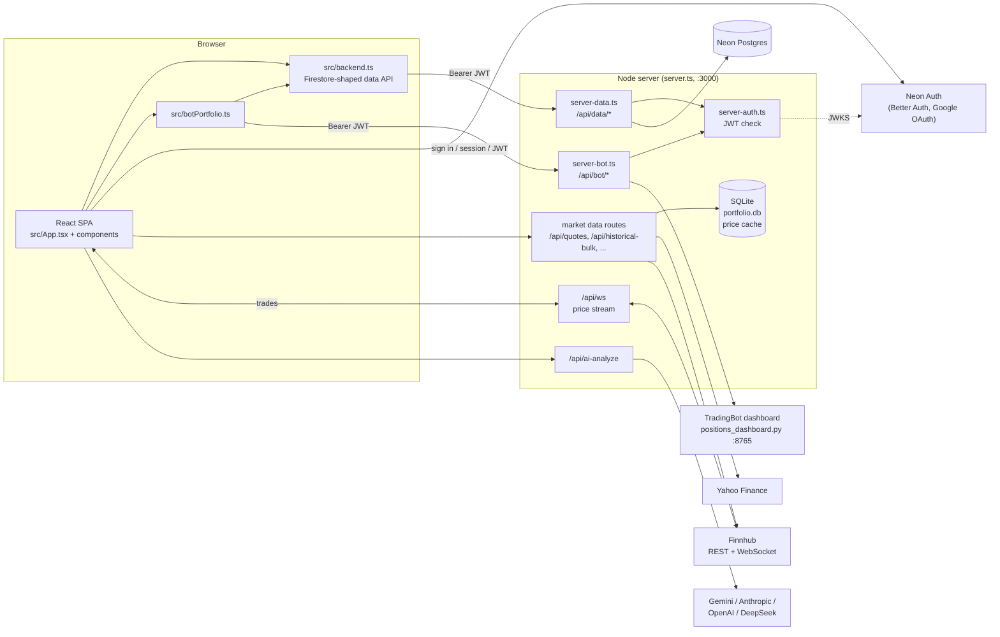

# Architecture

Stock Portfolio Tracker is a single-user-style web app for tracking stock
portfolios (Global in USD, Australia in AUD) plus a read-only view of an
automated trading bot's positions. It is one Node process that serves both the
React frontend and a JSON API, with user data in Neon Postgres and market data
pulled from Yahoo Finance and Finnhub.

Originally generated in Google AI Studio on Firebase (Auth + Firestore); moved
to Neon in `902d487`. Much of the code still reads like Firestore because the
data layer deliberately kept that API shape (see [Data layer](#data-layer)).

## System overview

## Runtime

| | |
|---|---|
| Dev | `npm run dev` → `tsx server.ts`; Vite runs as Express middleware (HMR) |
| Prod | `npm run build` (Vite client → `dist/`, esbuild server → `dist/server.cjs`), `npm start` |
| Port | `3000`, bound to `0.0.0.0` (reachable from the LAN) |
| Schema | `npm run db:migrate` applies `db/schema.sql` (idempotent) |
| Config | `.env` (gitignored); names listed in `.env.example` |

## Repository layout

| Path | What it is |
|---|---|
| `server.ts` | Express app: market-data, AI, email and legacy routes; Finnhub/WebSocket relay; Vite/static hosting |
| `server-auth.ts` | Neon Auth JWT verification middleware (JWKS, EdDSA) |
| `server-data.ts` | Authenticated per-user data API over Postgres (`/api/data/*`) |
| `server-bot.ts` | Owner-only proxy to the TradingBot dashboard (`/api/bot/*`) |
| `db/schema.sql`, `db/migrate.ts` | Postgres schema and the migration runner |
| `db/import-firebase-export.ts` | One-off copy of a user's Firebase JSON exports into Neon (dry-run by default) |
| `src/main.tsx` | React entry point |
| `src/App.tsx` | Almost the entire UI and client logic (~10k lines): state, portfolio math, widgets, modals |
| `src/backend.ts` | Client data layer: Neon Auth client + Firestore-compatible data helpers |
| `src/botPortfolio.ts` | Loads the bot's data, maps it to read-only holdings, bot actions |
| `src/components/` | Extracted widgets: charts, transactions, alerts, TWR calculator, bot view, etc. |
| `src/utils/portfolioCalculations.ts`, `src/lib/` | Portfolio math, currency formatting, Fear & Greed index |
| `test*.ts`, `workspace/`, `app/applet/` | Ad-hoc scripts left from AI Studio; not part of the app |

## Authentication

- **Provider:** Neon Auth (managed Better Auth) on the Neon project's `main`
  branch. Google sign-in uses Neon's shared OAuth credentials; `localhost` is
  trusted by default, other origins must be added as trusted domains.
- **Browser:** `authClient.signIn.social({ provider: 'google' })` redirects to
  Google and back. The session lives in Neon Auth's cookies; `getSession()`
  returns a short-lived (15 min) EdDSA JWT, which the SDK caches and renews.
- **Server:** every `/api/data/*` and `/api/bot/*` request carries
  `Authorization: Bearer <jwt>`. `server-auth.ts` verifies it against
  `${NEON_AUTH_BASE_URL}/.well-known/jwks.json` and the issuer, and exposes
  `{ id, email, emailVerified }`.
- **Users** are stored by Neon Auth in the `neon_auth` schema; app tables key
  rows by `user_id` = JWT `sub`.

## Data layer

### Storage (Neon Postgres, `db/schema.sql`)

| Table | Kind | Notes |
|---|---|---|
| `holdings` | typed rows | ticker, shares, avg_price, currency, `portfolio_type` (`global`/`australia`), `sort_order`, `updated_at` |
| `transactions` | typed rows | buy/sell, shares, price, date, optional `lot_id`; FK to `holdings` with `ON DELETE CASCADE` |
| `alerts` | typed rows | price alerts: ticker, condition, target price, triggered flag |
| `settings` | JSON document per user | tab settings, profile, AI config, table layout, calendar events (`data jsonb`) |
| `backups` | JSON document per user | single-slot undo buffer for "Reset portfolio" |

`settings` and `backups` still carry unused columns from the first schema
(`tabs`/`profile`, `holdings`/`transactions`/`tab`); their content was copied
into `data`.

### Server API (`server-data.ts`)

`/api/data/:collection[/:id]` with `GET` (list with `?field=value` equality
filters, or one), `POST` (create; an array body inserts all rows in one
transaction), `PUT` (create-or-overwrite; `?merge=1` merges), `PATCH`, `DELETE`.

- Every query is scoped with `user_id = <jwt sub>`; client-supplied `userId`
  is ignored. This replaces the old `firestore.rules`.
- Row collections map a fixed set of client field names to columns; unknown
  fields are dropped and values are type-checked.
- Document collections store the body as JSON; merge writes deep-merge nested
  objects (Firestore `setDoc(..., { merge: true })` semantics).
- Upserts with a client-supplied id can never take over another user's row.

### Client (`src/backend.ts`)

Exports the same functions the app used from Firebase: `collection`, `doc`,
`query`, `where`, `getDocs`, `getDoc`, `addDoc`, `setDoc`, `updateDoc`,
`deleteDoc`, `onSnapshot`, `serverTimestamp`, plus `auth`,
`onAuthStateChanged`, `signInWithPopup`, `signOut`. Components therefore only
changed their import path in the migration.

- **`onSnapshot`** is emulated: an initial fetch, then a refetch whenever this
  tab writes to the same collection. Changes made elsewhere appear on reload.
- **`withBatchedUpdates(fn)`** holds back refetches until a multi-step write
  finishes, so listeners never see a holding before its transactions exist.
- **Timestamps** (`updatedAt`, `createdAt`) come back as a `Timestamp`-like
  object with `toDate()`, matching Firestore.
- **Virtual documents** (`setVirtualDocs`) let another source contribute
  read-only documents to query results; the Trading Bot uses this. Any write to
  a virtual id or to the `bot` portfolio is refused client-side.

### Self-heal

`App.tsx` creates an opening "buy" transaction for any holding that has shares
but no transactions. It skips holdings changed in the last minute, re-checks
the database before writing, and never runs twice for one holding, because a
holding is always written a moment before its transactions.

## Market data

All server-side, in `server.ts`, with in-memory caches (quotes 1 min, metadata
and betas 24 h, earnings 12 h) and a SQLite cache for historical prices:

| Route | Source | Used for |
|---|---|---|
| `/api/quotes` | Yahoo Finance (Finnhub fallback) | prices, previous close, market state |
| `/api/historical-bulk` | Yahoo Finance + SQLite cache | performance charts, period returns |
| `/api/metadata`, `/api/logo/:symbol` | Yahoo / Finnhub / favicons | sector, industry, logos |
| `/api/earnings`, `/api/dividends`, `/api/calendar/earnings.ics` | Yahoo / Finnhub | calendar widgets and export |
| `/api/financials`, `/api/beta`, `/api/fear-greed`, `/api/search` | various | stock detail, risk, sentiment, search |

**Live prices:** the server holds one Finnhub WebSocket (only when
`FINNHUB_API_KEY` is set) and relays trades to browsers over `/api/ws`.
Browsers send `{ type: 'subscribe', symbols }` for everything they hold. A
free Finnhub key allows one connection, so running another copy of the app
with the same key makes them disconnect each other. Without a key, prices
only update on page load and Refresh.

## Trading Bot tab

A third tab backed by the separate TradingBot project's dashboard server
(`positions_dashboard.py`, default `http://127.0.0.1:8765`), which must be
running on the same machine.

- **Proxy (`server-bot.ts`):** forwards an allow-list only:
  `GET /api/bot/positions`, `/trade-history`, `/housekeeping-status`, and
  `POST /api/bot/close-position`, `/run-housekeeping`. The last two **place
  real orders** through the bot.
- **Access:** the bot dashboard has no authentication and this server listens
  on the LAN, while any Google account can sign in. So every bot route requires
  a verified sign-in whose email equals `BOT_OWNER_EMAIL`; if that isn't set,
  the routes return 503. Symbols are validated before forwarding.
- **Client (`src/botPortfolio.ts`):** loads positions and closed trades on
  sign-in, when the tab opens, and every 5 minutes while it is visible. Each
  load can cost the bot a Webull API call, so it doesn't poll faster. The data
  is also published as virtual holdings and transactions, so the combined
  summary includes the bot.
- **View (`BotPortfolioView.tsx`):** totals, realized P&L windows, and a card
  per position with a stop → entry → target bar, priced from the live quote
  stream. Close Position requires typing the symbol to confirm.

## AI features

`POST /api/ai-analyze` (alias `/api/gemini-analyze`) routes a prompt to
Gemini, Anthropic, OpenAI, DeepSeek or a custom endpoint, choosing the
provider from the request or the model name. Keys come from the server's
environment or from the user's own key saved in their settings and sent with
the request. Used for portfolio/stock analysis and extracting holdings from
uploaded broker statements. Saved analyses live in the SQLite `analyses`
table.

## Imports and exports

- **Portfolio JSON / CSV export**, **transaction history CSV / JSON export**.
- **Transaction import** rebuilds holdings from history, routing each row to
  its portfolio tab; it cannot reproduce holdings whose stored values were
  edited without matching transactions.
- **`db/import-firebase-export.ts`** copies holdings and transactions exactly
  as exported from the old Firebase app, linked by original ids, verifying
  totals before committing.

## Configuration

| Variable | Purpose |
|---|---|
| `DATABASE_URL` / `DATABASE_URL_UNPOOLED` | Neon Postgres (pooled for the app, direct for migrations) |
| `NEON_AUTH_BASE_URL` / `VITE_NEON_AUTH_URL` | Neon Auth base URL (server JWT checks / browser client) |
| `FINNHUB_API_KEY` | Live price stream and some fallbacks |
| `GEMINI_API_KEY`, `ANTHROPIC_API_KEY`, `OPENAI_API_KEY`, `DEEPSEEK_API_KEY` | AI features |
| `RESEND_API_KEY` | `/api/send-email` |
| `BOT_DASHBOARD_URL`, `BOT_OWNER_EMAIL` | Trading Bot tab |
| `MYSQL_URL` | Optional MySQL instead of SQLite for the server's own cache tables |

## Known debt

- **`src/App.tsx` is ~10,000 lines** holding most UI, state and business
  logic; changes there are high-risk and slow to review.
- **Legacy server routes from the AI Studio era:** `/api/portfolio*` (a
  separate SQLite portfolio unrelated to the Neon data), `/api/auth/url`,
  `/auth/callback` and `express-session` (an unused Google OAuth flow), and
  `/api/bot/portfolio` (hard-coded sample data, unauthenticated).
- **User-supplied AI API keys** are saved in plain text in the user's
  `settings` document and sent from the browser with each AI request.
- **No live sync between browsers:** `onSnapshot` only refreshes on this tab's
  own writes.
- **Data quality carried over from Firebase:** some holdings don't match their
  transaction history, and a few transactions are dated 1970.
- **No automated tests** in the repo; the data and bot APIs were verified with
  ad-hoc scripts during development. Root-level `test*.ts` files are manual
  probes, not a test suite.
- **`bun.lock`** is stale (still lists Firebase); `package-lock.json` is
  current.
